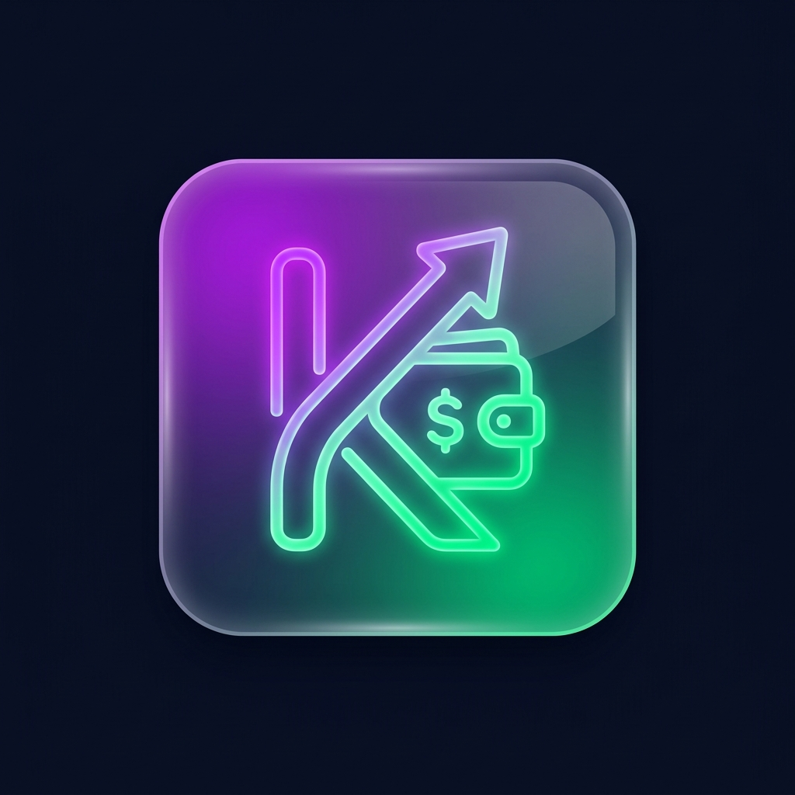

<div align="center">
  
  <h1>Kipo - Finance Tracker</h1>
  <p>Una aplicación web moderna y vibrante para el control de finanzas personales.</p>
</div>

## 🌟 Características
* **Diseño Glassmorphism**: Una interfaz de usuario deslumbrante, fluida y premium usando Tailwind CSS v4.
* **Control Mensual**: Filtra tus finanzas mes a mes con un selector de fechas personalizado.
* **Gestión de Deudas**: Marca tus gastos como pagados o pendientes con un solo clic.
* **Dashboard Analítico**: Gráficos dinámicos interactivos para ver exactamente a dónde va tu dinero.
* **Gestor de Categorías**: Crea, edita y elimina categorías para ingresos y gastos al vuelo usando modales interactivos.
* **Almacenamiento Local**: Tus datos se guardan instantáneamente en tu navegador, sin necesidad de base de datos externa por ahora (listo para escalar).

## 🚀 Tecnologías Usadas
* **React 18** (Vite)
* **TypeScript**
* **Tailwind CSS v4** (con diseño Glassmorphism)
* **React Router v6**
* **Recharts** (Para gráficas)
* **Lucide React** (Iconografía)

## 🛠 Instalación y Uso Local

1. Clona el repositorio:
```bash
git clone https://github.com/jeferun/Kipo.git
cd Kipo
```

2. Instala las dependencias:
```bash
npm install
# o con bun
bun install
```

3. Corre el servidor de desarrollo:
```bash
npm run dev
# o con bun
bun dev
```

4. Abre `http://localhost:5173` en tu navegador.

## 🤝 Contribuciones
¡Las contribuciones, issues y sugerencias son bienvenidas! 

---
Construido con ❤️ para un control financiero más inteligente.
